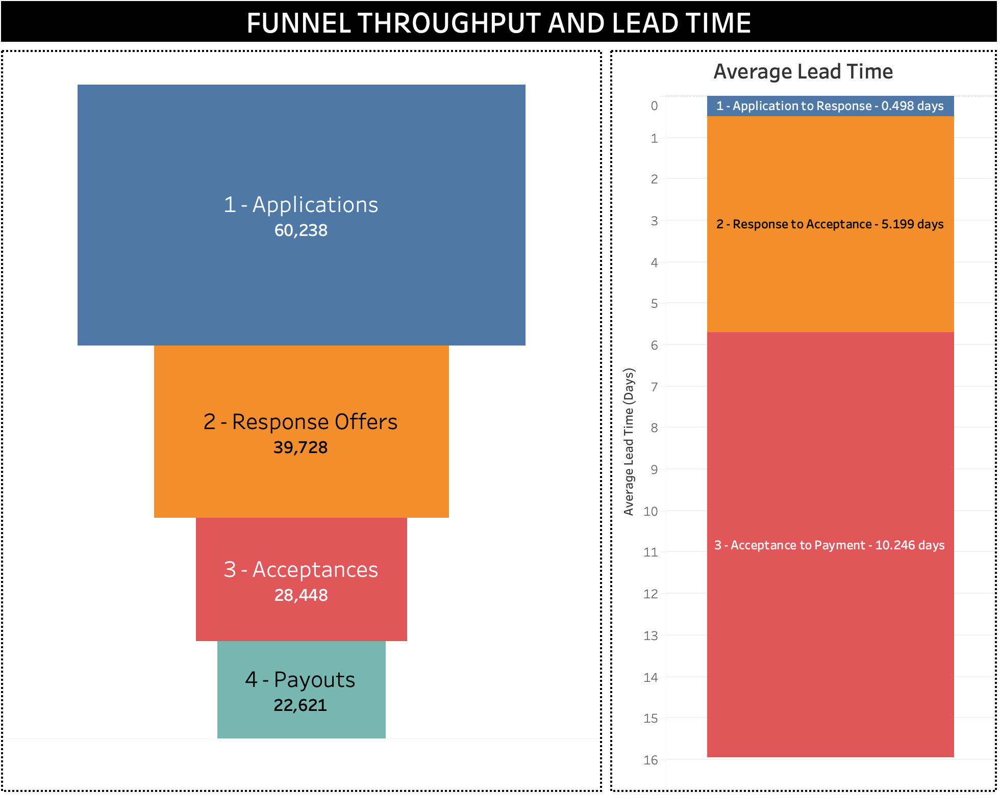

# Loan Pipeline Project [Extract data from APIs | ETL | Warehousing | Incremental Refresh | Visualization]

The work done under this project provides a ready to deploy package and ETL pipelines to setup an end-to-end data analytics solution starting from incremental data extraction from external APIs and writing the data into staging tables in MySQL and ELT procedures to generate a new set of tables as a semantic layer of business logic to provide lightweight data visualization via Tableau dashboards.

This documentation will provide a brief overview of how different components are set up within the project and showcase the outputs as Tableau dashboards.

Documentation on Tableau dashboards --> [Dashboard Documentation](/tableau_workspace/README.md)

## 1. Business use case and logic

The project is based on a hypothetical entity called ___Mini Loans___ who acts as an intermediary between _borrowers_ and _lenders_. They have a portal which poeple who wants to get loans could log in and apply and their application will be shared with a pool of lending partners who have signed up with ___Mini Loans___. Their business process looks as follows.


First the process starts when a user (an applicant) submits an __application__ for a loan in the portal. The application is then shared across to multiple lending partners and the lending partners send back __responses__ to the applications. The responses could be either __loan offers__ or __denials__. The applicants who received loan offers will then evaluate their options and choose to __accept__ one of the offfers. The accepted offers will then be processed by the respective lending partners and then will be __paid out__ either in full or partially to the applicants.

An glimpse of the dashboard component elaborating the above process is given below:



## 2. Data sources and structures

We have two external API endpoints namely __\applications__ and __\responses__ which fetches applications and responses data for a given date range. Sample outputs of data points are as follows.

### `\applications`

```
{
    "Acceptance Date": "2023-01-04",
    "Accepted Loan Status": "active",
    "Application Accepted By User Type": "admin user",
    "Application Created By User Type": "customer user",
    "Application Creation Date": "2023-01-01",
    "Application Id": "f9b03d9b-cce0-4da7-a9db-8ec4dad40e3f",
    "Application User Agent": null,
    "Has Co Applicant": false,
    "Paid Out Date": "2023-01-05",
    "Refinance": false,
    "Tracking Source Group Id": 1,
    "Tracking Source Id": 298,
    "Accepted Loan Amount": 2069.0,
    "Amortization Length": 84,
    "Applied Loan Amount": 4138,
    "Highest Approved Amount": 2069.0,
    "Paid Out Loan Amount": 2069.0
}
```

### `\responses`

```
{
    "Accepted By Customer": true,
    "Accepted Loan Purpose": "Health Vacation",
    "Application Id": "52a9cd7f-4ab9-4820-80cc-fddcea326c15",
    "Bank Name": "Galaxy Bank",
    "Response Creation Date": "2023-01-14",
    "Response Type": "loan_offer",
    "Response Withdrawn Date": null,
    "Interest Rate Effective": 10.0,
    "Missing Response": 0,
    "Offered Amount": 8276.0,
    "Rank Interest Rate": 2.0,
    "Rank Offered Amount": 1.0
}
```

These APIs fetch data from a datastore which is optimized for transactional processing hence is not advised to be used for direct querying to refresh dashboards (for OLAP). Hence I am tasked to implement data pipelines to periodically fetch data in an incremental fashion once data are being added to the system on a daily basis.

## 3. Architecture, ETLs and ELTs

The designed architecture is as follows.


To cater the data source constraint we have two scripts which can be used to fetch data from \applications and \responses for a given time period. The scripts 1 and 2 will fill data into two tables called _staging_applications_ and _staging_responses_.

Then to generate data which can be used to provide analytics on business logic without having to run heavy processing on BI component, we have scripts 3 and 4 which generates a sematic data layer (more like a data warehouse). The idea is to keep heavy processing on MySQL component and keeping the BI component (Tableau) as lightweight as possible.

The MySQL server is running inside a Docker container.

## 4. Semantic layer

The semantic layer of data which more business logic based can be generated each time an update is added to the staging tables. The schemas looks as follows:


The tables __chain__, __lead_time__ and __throughput__ are generated to provide quick analytics to show the status of applications going through the loan pipeline along with their lead times. Providing this information would be a heavy workload if they were to be queried each time the report is being used. Hence the sematic layer is generated.

## 5. How to use

A. Clone the git repository.

B. Navigate into the repository and run `docker compose up` --> this will start the MySQL persisted container.
C. Run following scripts in the given order to run the ETLs. 

01 - `etl_scripts/mysql_initialization.py`

02 - `etl_scripts/generate_DimDate.py`

03 - `etl_scripts/fetch_applications.py`

04 - `etl_scripts/fetch_responses.py`

05 - `etl_scripts/run_sql_elt.py`

Once the scripts are fully run, the database is ready to be queried by Tableau

C. Open `tableau_workspace/odnel-db-v3.twb` and provide the credentials given in `docker-compose.yaml` file for the MySQL container. Default: user - `root`, password - `odnel`.

D. Clean up

Run `docker compose down`