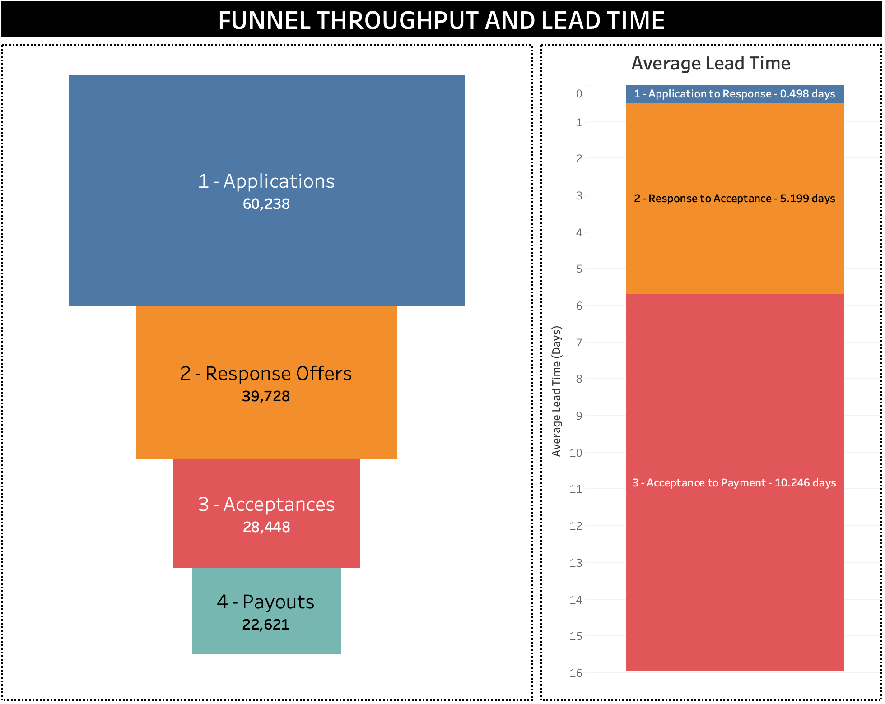
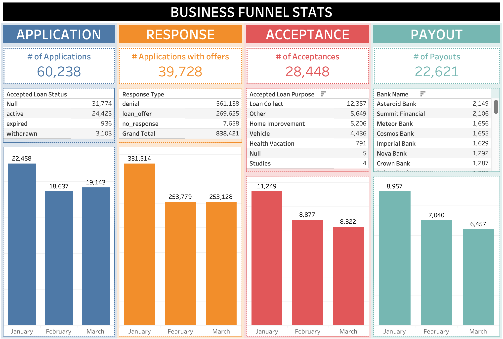
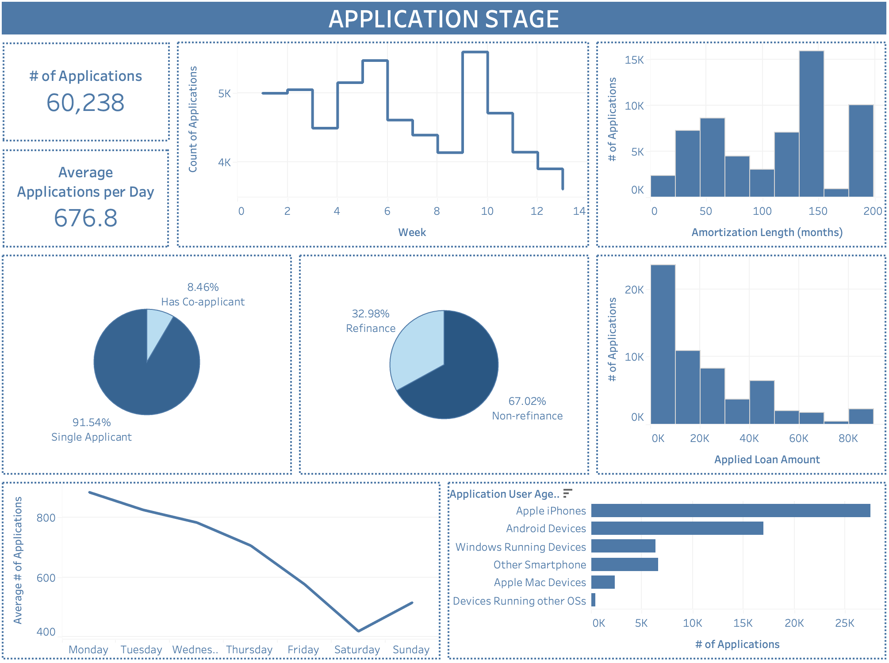
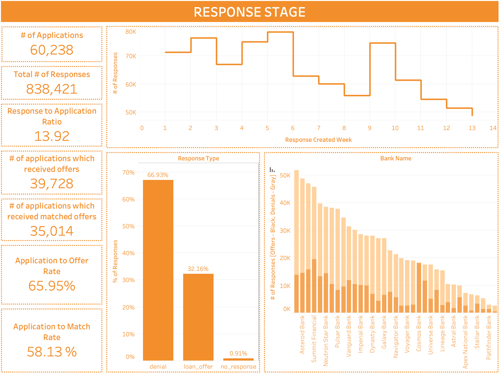
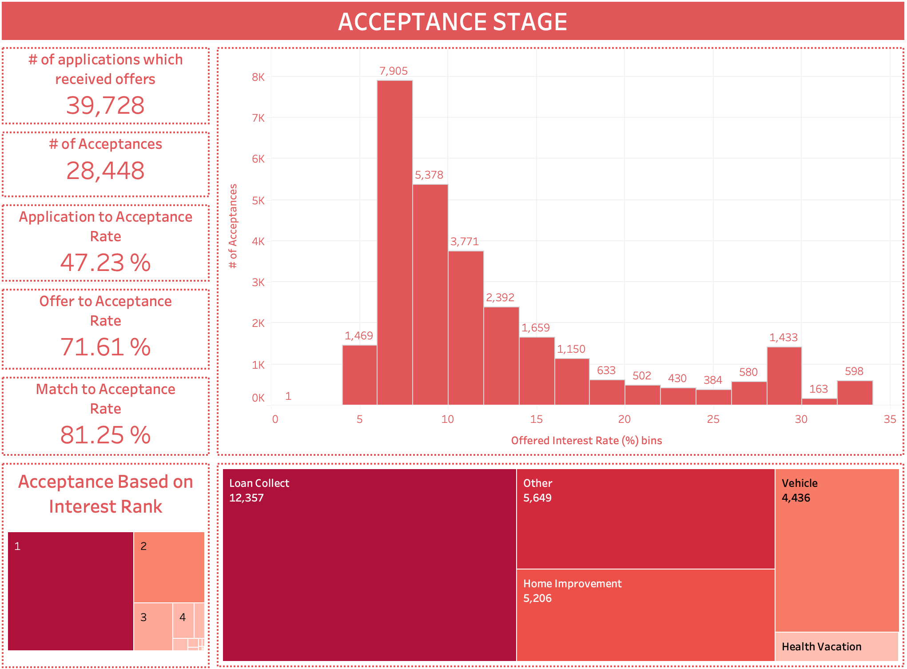
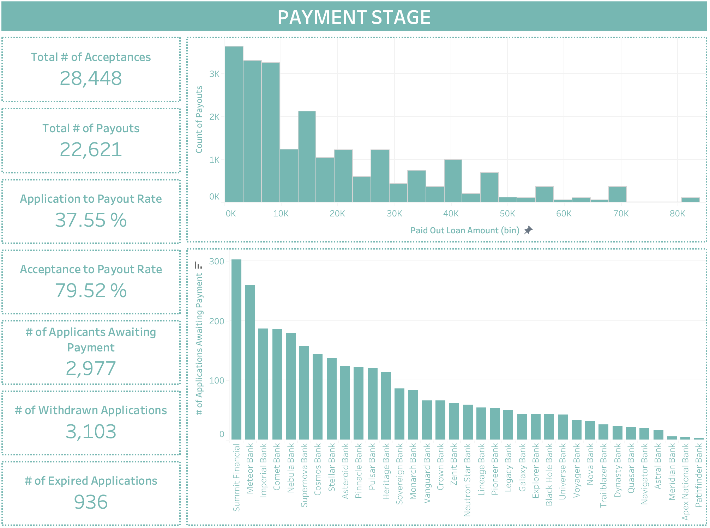
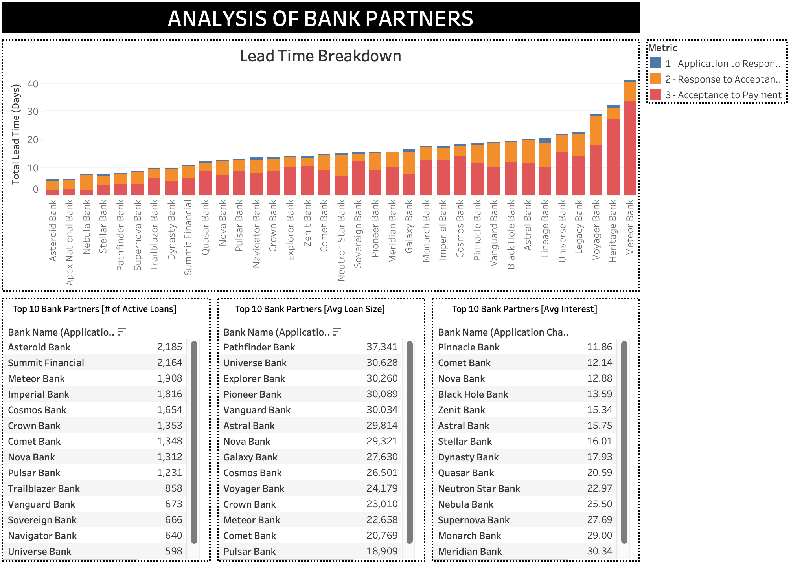
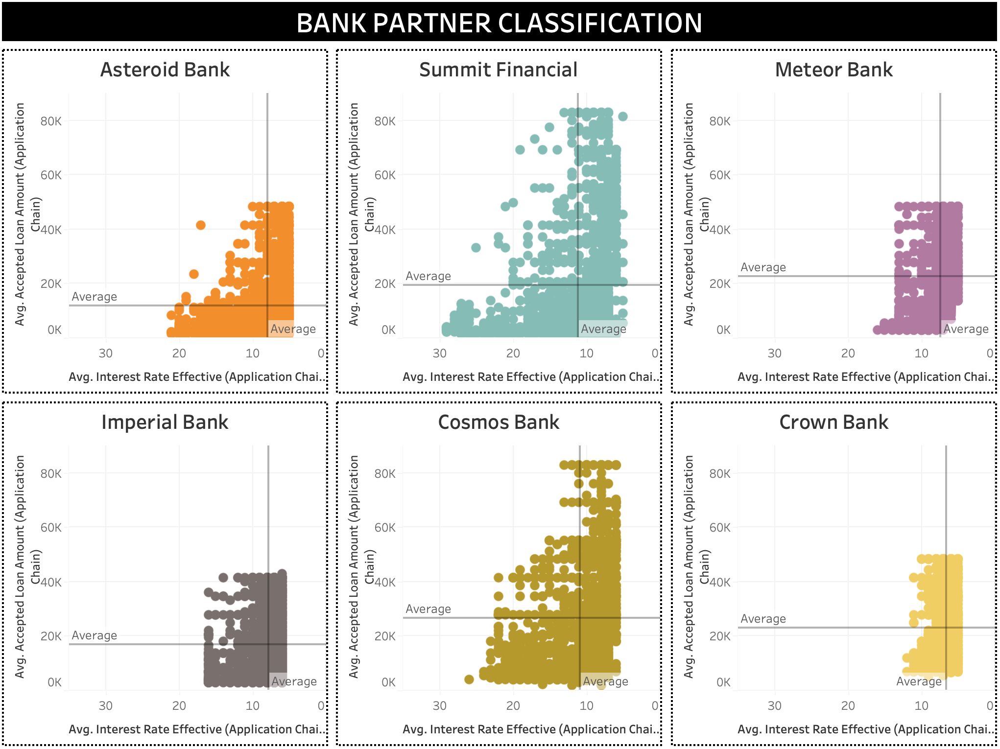
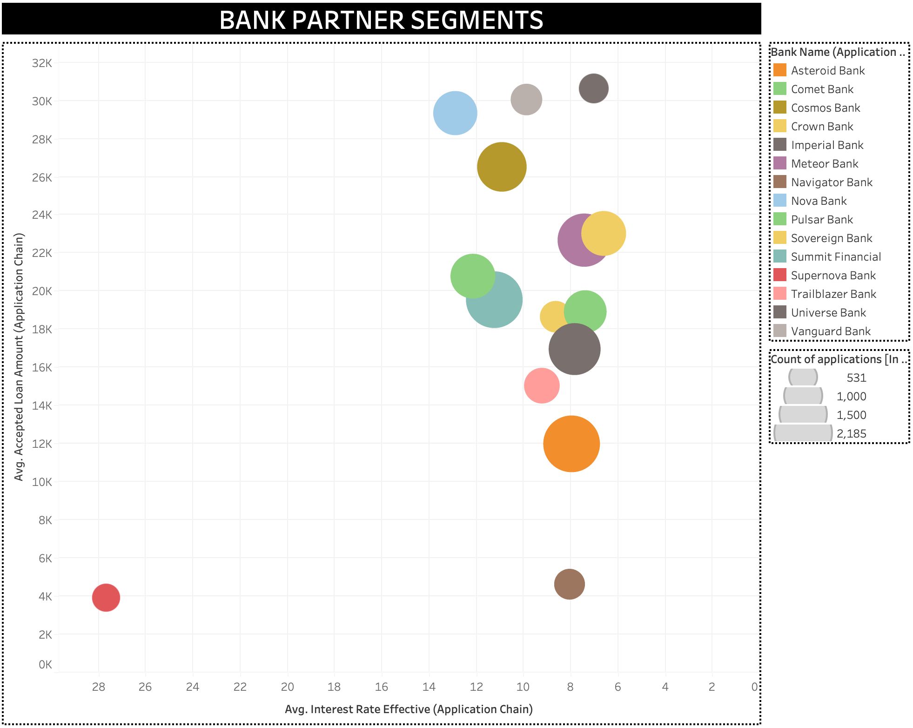

# Dashboard Documentation

This documentation contains a discussion about the analytics generated in this project. Please refer to the [project documentation](/README.md) to get an overall understanding of the business use case if something is unclear.

## 1. Funnel Throughput and Lead Time

The following dashboard gives a high level view of how applications are getting processed across the pipeline in terms of quantities and lead time. The lead time from acceptance to payout seems significant and will have to be looked at in depth --> which will be done in part 7.

## 2. Business Funnel Stats

This dashboard provides more details about the stages of the loan pipeline.

## 3. Application Stage

This dashboard provides an in depth view of what is happening inside the application stage.

## 4. Responses Stage

This dashboard provides an in depth view of what is happening inside the responses stage. The conversion rates are very important to be looked at.

## 5. Acceptance Stage

This dashboard provides an in depth view of what is happening inside the acceptance stage. The conversion rates are very important to be looked at.

## 6. Payment Stage

This dashboard provides an in depth view of what is happening inside the payout stage. The conversion rates are very important to be looked at. Also, the applicantions which have been accepted but being lagging due to non-payment by the lending partners are clearly visible here.

## 7. Performace Analysis of Lending Partners

This dashboard provides an in depth view of the lead times broken down to lending partner levels. There's other measurements such as a lending partner's performance based on the number of loans given, the amounts given and the interest rates offered.

What can be seen is that there is no one lending partner who is good at all aspects. It is a give and take when it comes to different features. For example _Meteor Bank_ provides high number of loans, but they take very long to process the payments.

## 8. Classification of Lending Partners Based on Loan Amount and Interest Rates

This dashboard shows how each top lending partners can be classified based on the average loan amounts they provide and the interest rates they are willing to offer. You can see the banks which are providing high number of loans are mostly providing small sized loans.

## 9. Bank Partner Segments

This dashboard shows how each top lending partners can be classified in overallbased on the average loan amounts they provide and the interest rates they are willing to offer. Using this an applicant could choose what kind of partner they would like to choose; whether to go for a big loan with lower interest rates compensating on the processing time or any other likely option.

NOTE: See `odnel-db-v3.twb` to view how the dashboards have been created.